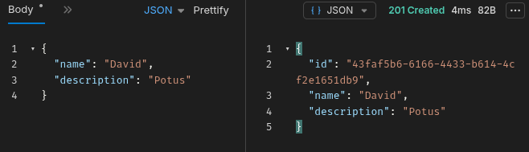
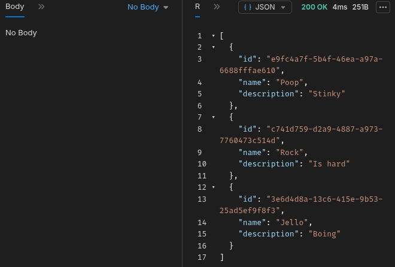
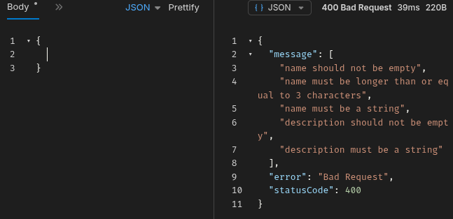

# 🚀 Backend API: DevMatch Profile Management (NestJS)

Esta é uma API robusta desenvolvida com NestJS, focada no gerenciamento de perfis para a plataforma DevMatch. O projeto demonstra a aplicação de uma arquitetura modular e escalável, utilizando as melhores práticas do ecossistema Node.js empresarial.

## 📋 Sobre o Projeto
O projeto consiste em um sistema onde usuários podem se cadastrar, realizar login e gerenciar (CRUD) suas próprias postagens. A aplicação segue o padrão de arquitetura **MVC (Model-View-Controller)** para garantir organização e escalabilidade.

## 🛠 Tecnologias Utilizadas
- **Runtime:** Node.js
- **Framework:** NestJS
- **Linguagem:** TypeScript (Tipagem forte e segurança)
- **Validação:** Class-validator & Pipes
- **Ferramenta de CLI:** Nest CLI
- **Variáveis de Ambiente:** Dotenv
- **Ferramentas de Teste:** [Bruno](https://www.usebruno.com/)

## 🔑 Funcionalidades Principais

### Autenticação de Usuários
- **Registro:** Criação de conta com criptografia de senha via Bcrypt.
- **Login:** Autenticação segura comparando hashes.
- **Logout:** Encerramento de sessão.

### Gerenciamento de Postagens (CRUD)
- **Create:** Cadastro de novos desenvolvedores com validação de dados via Pipes.
- **Read (All):** Listagem completa de usuários da plataforma.
- **Read (ID):** Busca detalhada de um perfil específico por identificador único.
- **Update:** Atualização parcial ou total de informações do perfil.
- **Delete:** Remoção de perfis do sistema.

## 🏗 Arquitetura e Conceitos Aplicados
O NestJS utiliza conceitos avançados que foram aplicados neste projeto:
- **Arquitetura Modular:** Organização do código em módulos independentes (ProfilesModule).
- **Injeção de Dependência:** Uso de @Injectable para gerenciar serviços e desacoplar a lógica de negócio.
- **Exception Filters:** Tratamento global de erros para garantir respostas HTTP padronizadas.
- **DTOs (Data Transfer Objects):** Definição rigorosa da estrutura de dados que trafega na API.
- **Controller & Service Pattern:** Separação clara entre a camada de entrada (rotas) e a camada de lógica (serviços)..

## 🚀 Como Executar o Projeto

1. Clone o repositório:
   ```bash
   git clone https://github.com/DavidBB25/nestjs-crud.git
2. Instale as dependências:
    ```bash
    npm install
3. Inicie o servidor em modo desenvolvimento:
    ```bash
    npm run start:dev
    ```

## 🛣 Endpoints da API

### Perfis (Profiles)

- **GET /profiles - Listar todos os perfis**

- **GET /profiles/:id - Buscar um perfil pelo ID**

- **POST /profiles - Criar um novo perfil**

- **PUT /profiles/:id - Atualizar dados de um perfil**

- **DELETE /profiles/:id - Deletar um perfil**

## 📸 Teste da API (Bruno)

<details>
  <summary>Clique para ver os testes das rotas</summary>

  ### Criação de Perfil (POST)
  

  ### Listagem de Perfis (GET)
  

  ### Tratamento de Erro / Validação (Pipes)
  

</details>